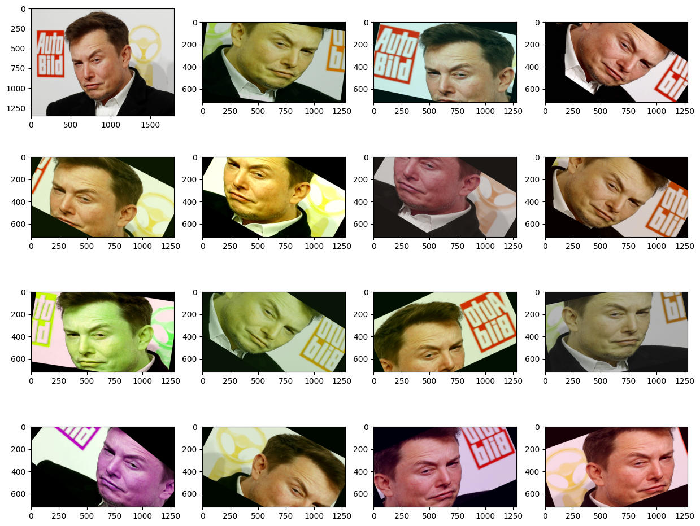
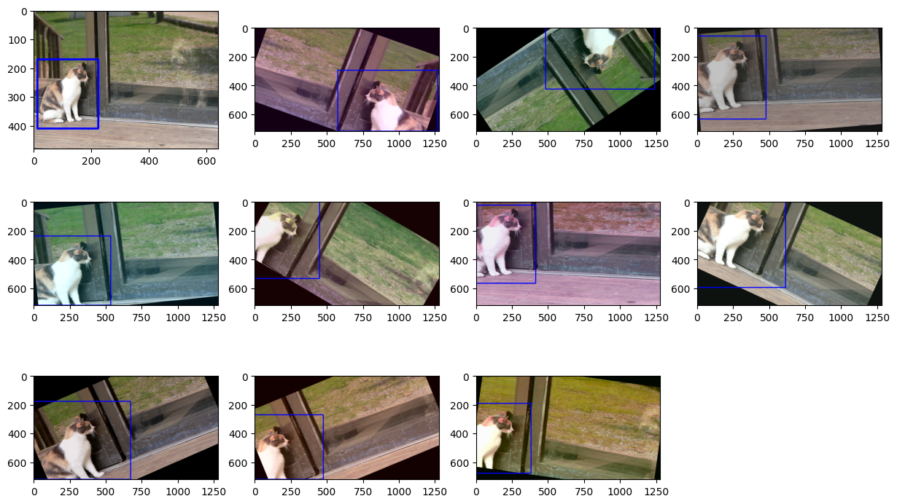
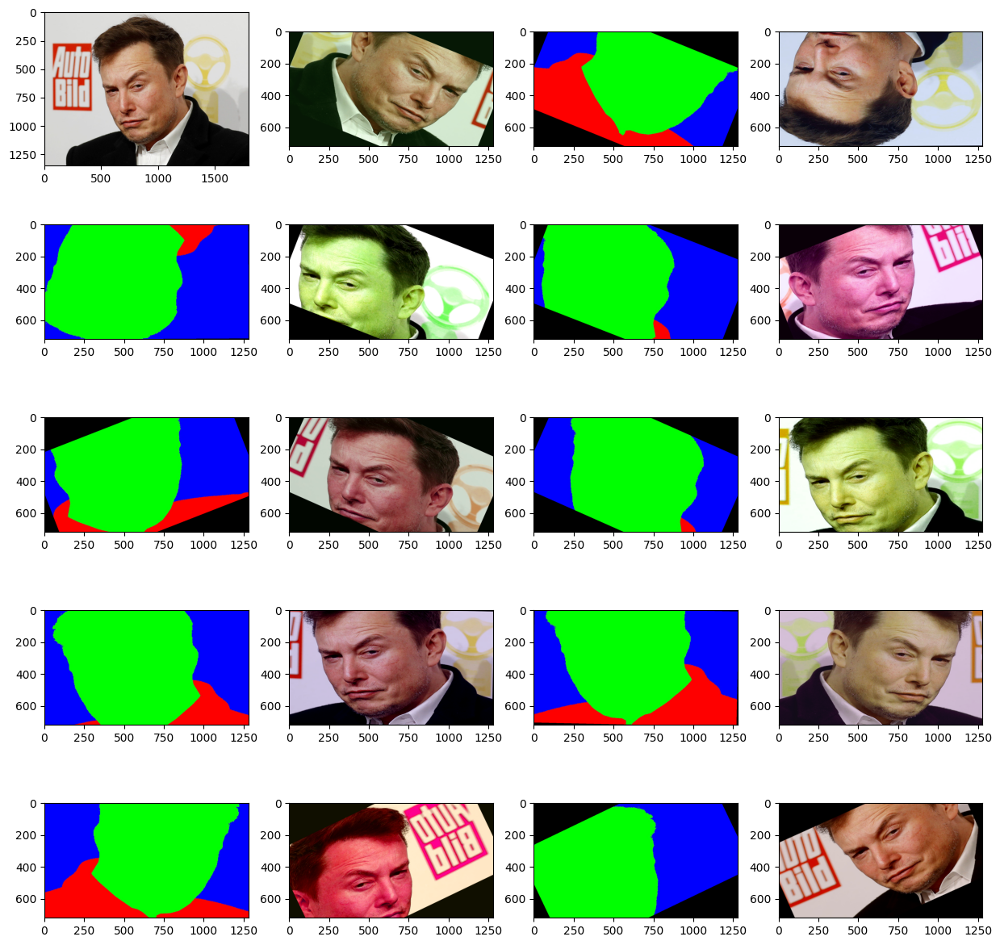
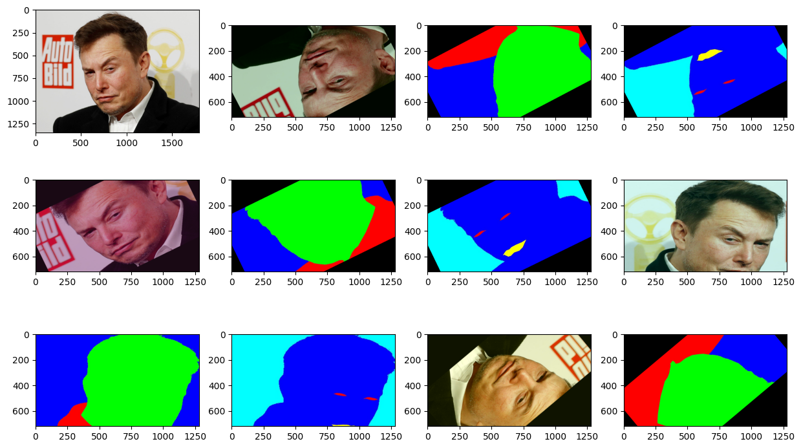

# Albumentations Vision Tasks

## Overview

This repository provides a series of scripts to test and demonstrate the functionality of the [Albumentations](https://albumentations.ai) package across different computer vision tasks, including image classification, object detection, and segmentation. The repository includes utility functions for visualizing images, bounding boxes, and masks, as well as examples of how to use Albumentations with PyTorch.

## What is Albumentations?

Albumentations is a powerful and flexible image augmentation library designed for machine learning practitioners and researchers. It offers a wide range of augmentation techniques that can be applied to images, bounding boxes, masks, and keypoints. These augmentations are essential for improving the robustness and generalization of computer vision models by simulating various real-world conditions that the model might encounter during inference.

### Why Use Albumentations?

1. **Ease of Use:** Albumentations provides a simple and intuitive API for applying complex augmentations.
2. **Performance:** The library is optimized for performance, making it suitable for large-scale datasets and real-time applications.
3. **Flexibility:** Albumentations supports a wide range of tasks, including classification, object detection, and segmentation, allowing for consistent augmentation pipelines across different tasks.
4. **Rich Set of Transformations:** The library includes standard transformations like rotations, flips, and color adjustments, as well as more advanced techniques like elastic transforms, grid distortions, and more.

## Repository Structure

- **`utils.py`**: Contains utility functions for visualizing images, bounding boxes, and masks.
- **`classification.ipynb`**: Demonstrates image augmentation techniques for classification tasks.
- **`detection.ipynb`**: Shows how to apply augmentations to both images and bounding boxes for object detection tasks.
- **`segmentation.ipynb`**: Focuses on augmenting images and their corresponding masks for segmentation tasks.
- **`full_PyTorch_example.ipynb`**: Integrates Albumentations with a PyTorch dataset for deep learning applications.

## Getting Started

### Prerequisites

- Python 3.6+
- Install the required packages by running:

```bash
pip install -r requirements.txt
```

### Usage

1. Classification Task `classification.ipynb`:

    - Load and augment images for a classification task.
    - Visualize the augmented images using `plt.show()`.
    - Example augmentations include resizing, random cropping, rotations, and color shifts.

2. Object Detection Task `detection.ipynb`:

    - Apply augmentations to both images and bounding boxes.
    - Visualize how bounding boxes are adjusted to remain accurate after augmentation.
    - Example augmentations include resizing, cropping, rotations, and flips.

3. Segmentation Task `segmentation.ipynb`:

    - Augment images and their corresponding segmentation masks.
    - Ensure that masks are aligned correctly with the images after augmentation.
    - Example augmentations include resizing, cropping, and distortion techniques.

4. PyTorch Integration `full_PyTorch_example.ipynb`:

    - Demonstrates how to integrate Albumentations into a PyTorch dataset.
    - Applies augmentations and converts images to PyTorch tensors for training a neural network.
    - Example augmentations include normalization and tensor conversion.

### Visualizing Augmentations

Each notebook includes visualizations of the augmented images (and bounding boxes or masks where applicable) using `plt.show()`. These visualizations help you understand the impact of each augmentation on the data.

## Examples

Here are some example outputs you can expect:

### Classification Example



### Detection Example



### Segmentation Example With 1 Mask



### Segmentation Example With 2 Masks



## Customization

Augmentation Pipelines: Feel free to modify the augmentation pipelines to suit your specific needs. Albumentations allows you to create complex pipelines that can include conditional augmentations, mixed augmentations, and more.
Visualization Parameters: You can adjust the plot_examples and visualize_bbox functions in utils.py to customize the appearance of your visualizations.

## Conclusion

This repository serves as a practical guide for using Albumentations in various computer vision tasks. By augmenting your datasets effectively, you can significantly improve the performance and robustness of your models. Whether you're working on classification, detection, or segmentation, Albumentations provides a powerful toolkit to enhance your data pipeline.
